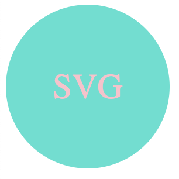
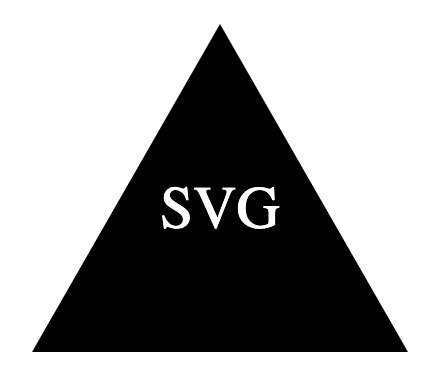

# SVG Generator - Challenge #10

## Description
In this project I have created an scalable vector graphic (SVG) generator using OOP (object oriented programming). Using Node.js the user can chooose a logo shape from a premade selection of circle, square, or triangle. The user can then input the shape color by using a color name or a hexadecimal code as well as unput text up to three characters long and, lastly, a text color (also by using a color name or hexadecimal code).

## Challenges

This project was a really hard one to dive into. The main challenge for me was just finding documentation to explain how to correlate everything within the seperate js files.  
Once I had the logo.svg files generating and I moved onto testing I realized that something with my code was not jiving with the test code that was provided. Instead of rewriting all of my code I decided, instead, to write three tests of my own that match my code's syntax and layout.  
If I have time later down the line I would like to go back to this project and reassess how I wrote my code so I can get the provided test code to work with the application. 

## Table of Contents
- [Installation](#installation)
- [Examples](#examples)
- [License](#license)
- [Tests](#tests)
- [Questions](#questions)

## Installation 

1. Open Terminal
2. Navigate to parent folder
3. Input 'node index.js'
4. Answer prompted questions
5. After getting the 'Generated logo.svg' notification open your code editor (VS Code, etc) and open your logo.svg file in a live browser. 

## Examples 

[Walkthrough Video](https://drive.google.com/file/d/1CBCYCTBtrCjvjoLIUWYiYIVV_1vqcP5E/view?usp=sharing)

## License 
This project is licensed under the MIT License.

Permission is hereby granted, free of charge, to any person obtaining a copy of this software and associated documentation files (the “Software”), to deal in the Software without restriction, including without limitation the rights to use, copy, modify, merge, publish, distribute, sublicense, and/or sell copies of the Software, and to permit persons to whom the Software is furnished to do so, subject to the following conditions: 

The above copyright notice and this permission notice shall be included in all copies or substantial portions of the Software. 

THE SOFTWARE IS PROVIDED “AS IS”, WITHOUT WARRANTY OF ANY KIND, EXPRESS OR IMPLIED, INCLUDING BUT NOT LIMITED TO THE WARRANTIES OF MERCHANTABILITY, FITNESS FOR A PARTICULAR PURPOSE AND NONINFRINGEMENT. IN NO EVENT SHALL THE AUTHORS OR COPYRIGHT HOLDERS BE LIABLE FOR ANY CLAIM, DAMAGES OR OTHER LIABILITY, WHETHER IN AN ACTION OF CONTRACT, TORT OR OTHERWISE, ARISING FROM, OUT OF OR IN CONNECTION WITH THE SOFTWARE OR THE USE OR OTHER DEALINGS IN THE SOFTWARE.

https://choosealicense.com/licenses/mit/

## Tests 

The tests for this project are located in the 'shapes.test.js' file in the 'lib' folder. Test are run using the Jest NPM.

There are three tests, one for each shape choice (circle, square, triangle), all tests include different shape colors, text, and text colors. 

To run this test, navigate in the terminal to the parent folder and type in 'npm test' and the three tests in the shapes.test.js will run.

## Questions 
Want to see more of my work? You can check out my Github profile by clicking my username below!

Github: [nikkivno](https://github.com/nikkivno) 

For any other questions or inquiries please feel free to reach out to my via email:

Email: nikkivigneault@gmail.com
